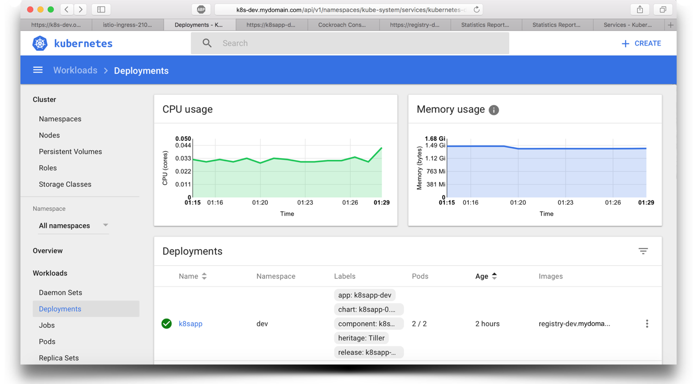
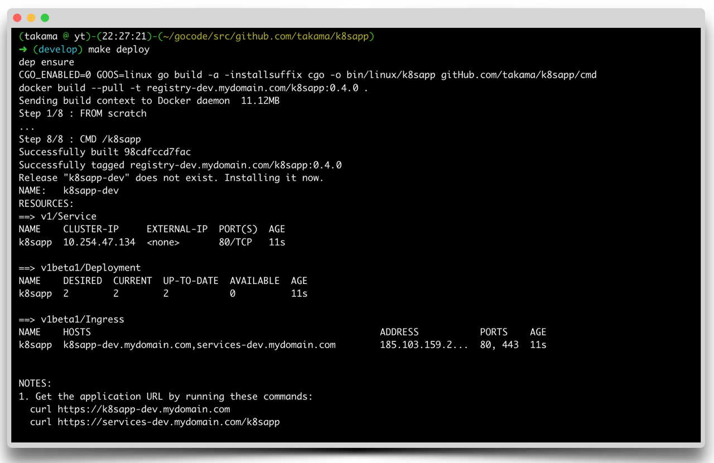

# Kubernetes application

[](https://travis-ci.org/takama/k8sapp)
[](https://github.com/takama/k8sapp/issues)
[](https://goreportcard.com/report/github.com/takama/k8sapp)
[](https://codecov.io/gh/takama/k8sapp)

A sample application that meets the requirements for successful execution in Kubernetes.



## Main application criteria

- Implementation of health checks
- Configuring the application through environment variables
- Standard logging Interface
- Processing of system interrupt signals and graceful shutdown
- Continuous build of the application and whole CI/CD process
- Helm charts for deploying an application in Kubernetes
- SSL support in a secure connection, certificate integration
- Integration of the official package manager `dep`
- Versioning automation

## Health checks

Kubernetes application must have [two health checks](https://kubernetes.io/docs/concepts/workloads/pods/pod-lifecycle/) for successful execution of the application. Integrated methods help correctly responding to Kubernetes queries.

## Configuring

The [twelve-factor](https://12factor.net/config) app stores config in environment variables. The application has a built-in library for automatic recognition and placement the environment variables in `struct` with different types.

## Logging

Provides a standard interface for a multi level logging. There is ability of choice of a logging library that supports a common interface.

```go
type Logger interface {
    Debug(v ...interface{})
    Debugf(format string, v ...interface{})
    Info(v ...interface{})
    Infof(format string, v ...interface{})
    Warn(v ...interface{})
    Warnf(format string, v ...interface{})
    Error(v ...interface{})
    Errorf(format string, v ...interface{})
    Fatal(v ...interface{})
    Fatalf(format string, v ...interface{})
}
```

Just make your choice

```go
func Run() (err error) {
    // log := xlog.New()
    // log := logrus.New()
    log := stdlog.New(&logger.Config{
        Level: logger.LevelDebug,
        Time:  true,
        UTC:   true,
    })
    ...
}
```

## System signals

The application includes the ability to intercept system signals and transfer control to special methods for graceful shutdown.

```go
type Signals struct {
    shutdown    []os.Signal
    reload      []os.Signal
    maintenance []os.Signal
}
```

## Build automation

A series of commands for static cross-compilation of the application for any OS. Building the Docker image and loading it into the remote public/private repository. Optimal and compact `docker` image `FROM SCRATCH`

## Testing

The command `make test` is running set of checks and tests:

- run go tool fmt on package sources
- run go linter on package sources
- run go tool vet on packages
- run tests on package sources excluding vendor
- compile and check of Helm charts

## Helm charts and Continuous Delivery

Prepared set of basic templates for application deployment in Kubernetes. Only one command `make deploy` is loading the application into Kubernetes. Just wait for the successful result and the application is ready to go.



## SSL support

Generating certificates to create a secure SSL connection in the `Go` client. Attaching the certificate to the Docker image.

```Dockerfile
FROM scratch

ENV K8SAPP_LOCAL_HOST 0.0.0.0
ENV K8SAPP_LOCAL_PORT 8080
ENV K8SAPP_LOG_LEVEL 0

EXPOSE $K8SAPP_LOCAL_PORT

COPY certs /etc/ssl/certs/
COPY bin/linux/k8sapp /

CMD ["/k8sapp"]
```

## Package manager

To work correctly with the dependencies we should choose the package manager. [dep](https://github.com/golang/dep) is a prototype dependency management tool for Go.

## Versioning automation

Using a special script to increase the release version

```sh
./bumper.sh
Current version 0.4.0.
Please enter bumped version [0.4.1]:
```

## Contributing to the project

See the [contribution guidelines](docs/CONTRIBUTING.md) for information on how to
participate in the Kubernetes application project by submitting pull requests or issues.

## License

[MIT Public License](https://github.com/takama/k8sapp/blob/master/LICENSE)
